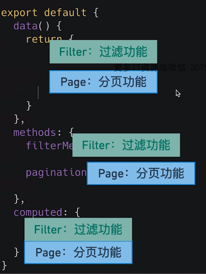
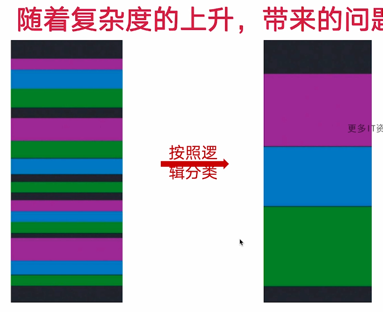
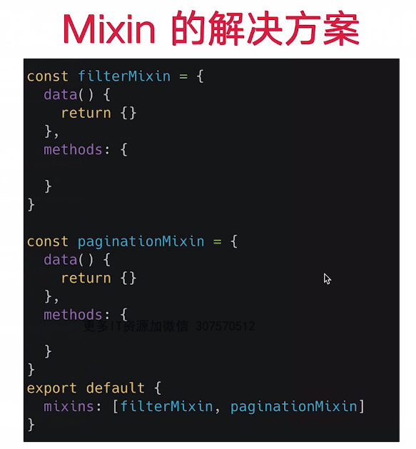

https://v3.vuejs.org
https://github.com/vuejs/create-vue

css: Bootstrap | Tailwind css  


# 特性
 ref 和 reactive
 computed 和 watch
 新的生命周期函数
 自定义函数 -- Hooks 函数

 Teleport -- 瞬移组件的位置
 Suspense -- 异步加载组件的新福音
 全局API的优化和修改
 新特性

# vue 遇到的问题
1. 随着功能的增长 复杂组件的代码变得难以维护




Mixin 缺点
- 命名冲突
- 不清楚暴力出来变量的作用
- 重用到其他component 经常会遇到问题



Vue2 对于 typescript 的支持非常有限
 


 ```
  # 全局配置
 vue.config --> app.config
 config.productinoTip 被删除
 config.ignoredElements ---改名-> config.isCustomElement
 config.keyCodes 被删除 

 #全局注册
 Vue.componetn -->app.component
 Vue.directive--> app.directive

 # 行为扩展类 API
 Vue.mixin --> ap.minxin
 Vue.use  --> app.use

 Global API Treeshaking  //
 ```
 
 
 Vetur 插件 给 vue 的开发带来便利 vue 模板完美支持 自动补全
 ```
 "vetur.experimental.templateInterpolationService": true
 ```
 
 npm i -g @vue/cli
 vue create xxxxx

 # jsx 
 (babel-plugin-jsx)[https://github.com/vuejs/babel-plugin-jsx]
 
 
